  
  # Hi there, I'm Tejaswee Sulekh!
  ### AI & Systems Engineer | Edge ML, Low-Latency Backends & Optimization
  
  
  

---

### About Me

I am an AI and Systems Engineer with a background in Electrical Engineering from IIT Bombay. My work sits at the intersection of hardware and software, focusing from how complex machine learning models can be adapted to run efficiently at scale and on the edge to how to extract as much performance from a model without loosing out on any energy or memory constraint.

I am passionate about building fast, system-aware software. If a challenge involves improving throughput, squeezing out latency, or fine-tuning an architecture for peak efficiency, I am fully engaged. Having a firm grasp of the underlying hardware allows me to write highly optimized code, whether I am deploying AI to resource-constrained devices or managing complex, high-concurrency infrastructure.

-  Architecting low-latency, event-driven backends and building lightweight, locally hosted AI ecosystems.
-  Hardware-level software optimization, zero-bloat web frameworks, and resilient end-to-end MLOps lifecycles.
-  Algorithmic design, rigorous memory management, and bridging the gap between high-level APIs and hardware execution.
---

### Tech Stack & Tools

| Category | Technologies |
| :--- | :--- |
| **Languages** |     |
| **Machine Learning** |    |
| **DevOps & Data** |      |

---

### Featured Projects

- **[Real-Time Fraud Detection System](https://github.com/TejasweeSulekh/Fraud-Detection-System)**
  Architected and deployed a scalable pipeline capable of detecting fraudulent activity in real-time data streams.
  *(Technologies: Python, Kafka, Docker, FastAPI, MLflow, Streamlit)*

- **[Edge-Deployable AI Agent](#)**
  In the process of building a locally hosted AI assistant utilizing modern software principles to ensure user privacy, low latency, and efficient resource usage.
  *(Technologies: Ollama, FastAPI, Streamlit)*

- **[Audio Signal Processing Framework](#)**
  Developed and optimized highly efficient low-latency pipelines for complex audio processing and its analysis.
  *(Technologies: Python, TensorFlow, C)*

- **[IoT Neural Network Integration](#)**
  Programmed a hardware abstraction layer (HAL) and implemented OTA updates to bridge software neural networks with physical Bluetooth Low Energy (BLE) edge devices.
  *(Technologies: C/C++, Embedded Systems)*

---

### GitHub Stats

  
  

